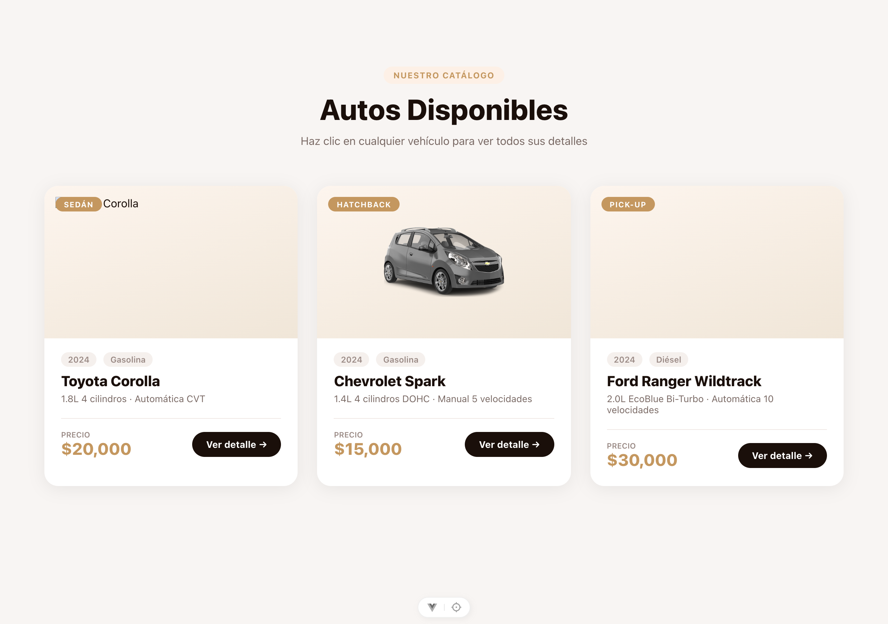
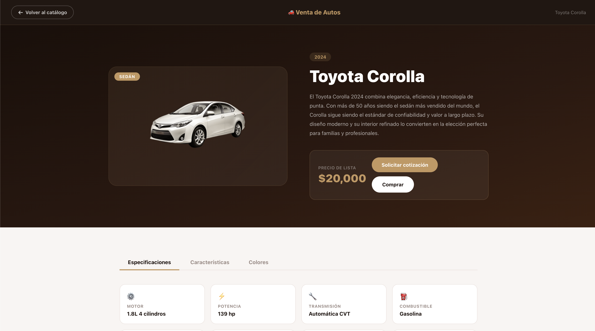
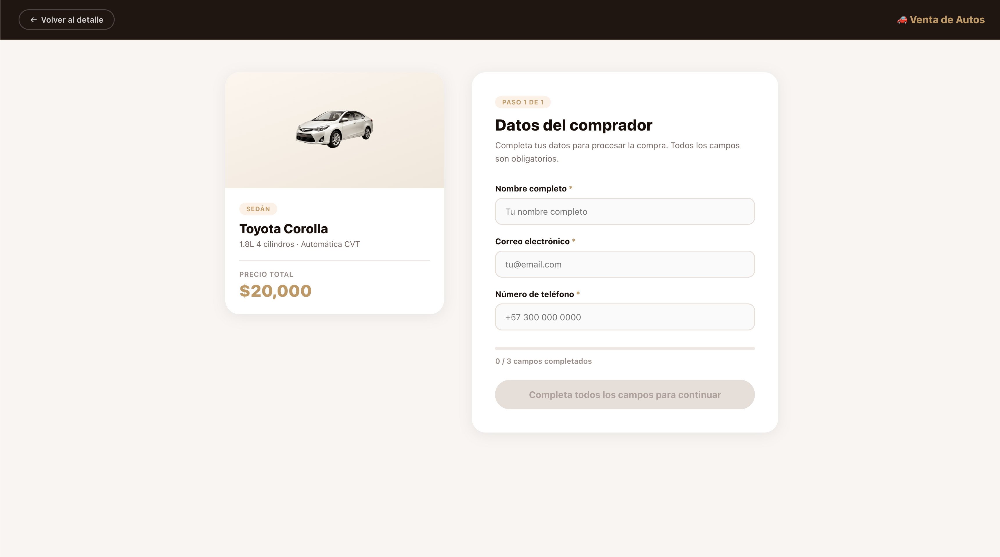
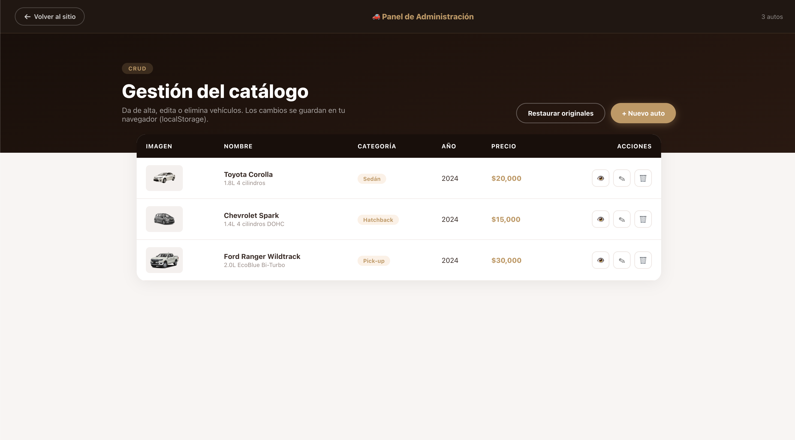
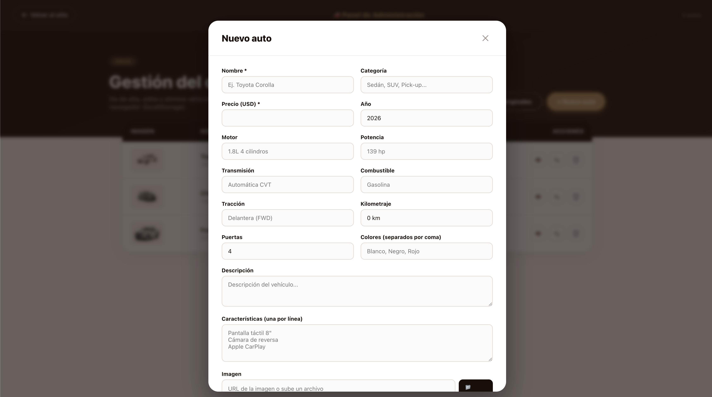

# 🚗 Catálogo de Carros — Venta de Autos

Aplicación web de venta de vehículos desarrollada con **Vue 3 + Vite**. Permite explorar un catálogo de autos, ver el detalle de cada uno, simular un proceso de compra completo y administrar el catálogo desde un panel CRUD que persiste los cambios en `localStorage`.

**Proyecto estudiantil · Politécnico Grancolombiano**
Asignatura: Front End · Docente: Oscar Campos Porras · Grupo B03

---

## Capturas de pantalla

### Página principal — Hero


### Catálogo de autos (carrusel)


### Detalle del vehículo


### Formulario de compra


### Confirmación de compra


### Panel de Administración — Listado CRUD


### Panel de Administración — Formulario de alta / edición


---

## Páginas y rutas

| Ruta | Descripción |
|---|---|
| `/` | Página principal con hero, carrusel de autos, lista de precios y formulario de contacto |
| `/auto/:id` | Detalle completo del vehículo con especificaciones y tabs |
| `/auto/:id/comprar` | Formulario de compra con validación en tiempo real |
| `/compra-exitosa` | Confirmación de compra con número de referencia |
| `/admin` | Panel CRUD para gestionar el catálogo (alta, baja, edición) |

---

## Funcionalidades principales

### Carrusel de autos disponibles
La sección **Autos Disponibles** del home muestra los vehículos en un carrusel con:
- Flechas **prev / next** con navegación cíclica
- **Dots indicadores** que permiten saltar a un slide específico
- Reactivo: cualquier auto agregado desde el panel admin aparece automáticamente

### Lista de Precios dinámica
La tabla de precios lista **todos** los autos del catálogo (incluyendo los dados de alta desde el admin), con buscador en tiempo real y ordenamiento por año o precio.

### Página de detalle
- Imagen del vehículo con animación de entrada al cargar
- Tabs interactivos: **Especificaciones**, **Características** y **Colores disponibles**
- Precio destacado con botones "Solicitar cotización" y "Comprar"
- Sección de otros vehículos disponibles

### Flujo de compra
1. El usuario hace clic en **Comprar** desde el detalle
2. Se muestra un formulario con nombre, correo y teléfono — el botón de confirmar está deshabilitado hasta que los 3 campos estén completos
3. Al confirmar, se redirige a una pantalla de éxito con número de referencia único y los próximos pasos

### Panel de Administración (`/admin`) — CRUD completo
Nueva ruta accesible desde el footer del home (link "Admin"). Permite:

| Acción | Descripción |
|---|---|
| **Crear** | Botón "+ Nuevo auto" abre un modal con formulario completo: nombre, categoría, precio, año, motor, potencia, transmisión, kilometraje, combustible, tracción, puertas, colores (separados por coma), descripción, características (una por línea) e imagen |
| **Leer** | Tabla con todos los autos del catálogo: miniatura, nombre, motor, categoría, año y precio |
| **Actualizar** | Icono ✎ en cada fila abre el modal precargado con los datos del auto |
| **Eliminar** | Icono 🗑 en cada fila pide confirmación y elimina el auto del catálogo |
| **Ver** | Icono 👁 navega al detalle público del auto |
| **Restaurar** | Botón "Restaurar originales" devuelve el catálogo a los 3 autos por defecto |

#### Imagen del auto
El formulario soporta **dos formas** de cargar la foto:
- Pegar una **URL** externa
- Subir un **archivo local** (botón 📁 Subir) — se convierte a `data:` URL para guardarse junto al resto en `localStorage`

#### Persistencia
Todos los cambios (altas, ediciones y eliminaciones) se guardan en `localStorage` bajo la clave `catalogo-carros-data`. Al recargar la página el catálogo se reconstruye desde ahí. Si la clave no existe, se cargan los 3 autos por defecto definidos en `src/data/cars.js`.

---

## Tecnologías

| Tecnología | Uso |
|---|---|
| [Vue 3](https://vuejs.org/) | Framework principal (Composition API con `<script setup>`) |
| [Vite 8](https://vite.dev/) | Build tool y servidor de desarrollo |
| [Vue Router 4](https://router.vuejs.org/) | Navegación entre páginas (SPA) |
| Reactividad de Vue + `localStorage` | Store reactivo compartido con persistencia automática (`watch` + `JSON.stringify`) |
| CSS Scoped | Estilos encapsulados por componente |

---

## Instalación y uso

```bash
# Instalar dependencias
npm install

# Iniciar servidor de desarrollo
npm run dev

# Build para producción
npm run build
```

El servidor de desarrollo estará disponible en `http://localhost:5173`.

> Para limpiar los datos guardados y volver al catálogo original, abre la consola del navegador y ejecuta `localStorage.removeItem('catalogo-carros-data')`, o usa el botón **Restaurar originales** del panel admin.

---

## Estructura del proyecto

```
src/
├── data/
│   └── cars.js              # Datos semilla (autos por defecto)
├── stores/
│   └── carsStore.js         # Store reactivo + persistencia en localStorage
├── router/
│   └── index.js             # Configuración de rutas (incluye /admin)
├── views/
│   ├── HomeView.vue         # Página principal con carrusel y lista de precios
│   ├── CarDetailView.vue    # Detalle del vehículo
│   ├── ComprarView.vue      # Formulario de compra
│   ├── CompraExitosaView.vue # Confirmación de compra
│   └── AdminView.vue        # Panel CRUD del catálogo
├── App.vue                  # Componente raíz con router-view
└── main.js                  # Punto de entrada
```

---

## Resumen de los cambios añadidos

1. **Nuevo store reactivo** `src/stores/carsStore.js` que centraliza el estado del catálogo, lo persiste en `localStorage` y expone las funciones `addCar`, `updateCar`, `deleteCar`, `getCarById` y `resetCars`.
2. **Vista de administración** `src/views/AdminView.vue` con CRUD completo, formulario en modal, validación, soporte de imagen por URL o archivo (data URL) y mensajes flash de confirmación.
3. **Ruta `/admin`** registrada en `src/router/index.js`.
4. **Carrusel** en la sección "Autos Disponibles" del home (flechas + dots, navegación cíclica, reactivo a los cambios del admin).
5. **Lista de Precios** que ahora muestra todos los autos del store (incluidos los nuevos).
6. Refactor de `HomeView`, `CarDetailView` y `ComprarView` para leer del store reactivo en vez de la constante estática.
7. Link al panel **Admin** agregado en el footer del home.

---

*2026 — Todos los derechos reservados*
